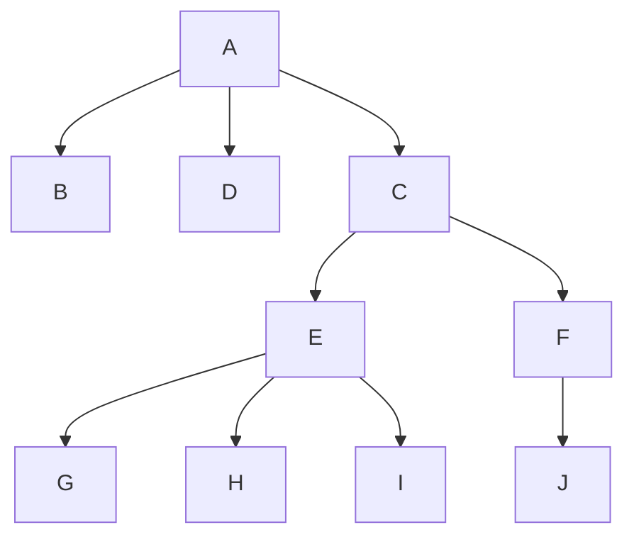
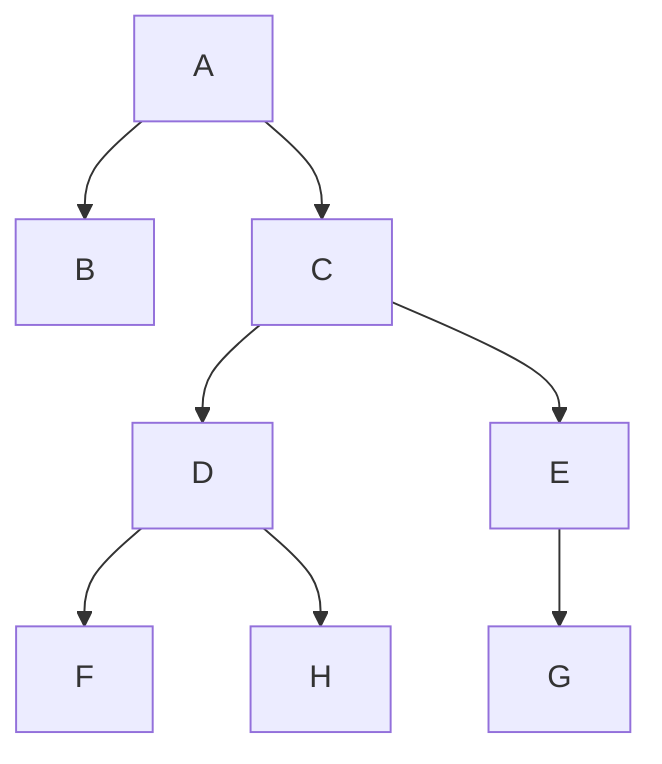

- data structure
- heirarcal data structure that has nodes. each node can point to any nodes
- unordered information
- non-linead
  - heirarchical: parent-child, teacher-student

A has 3 children
C has two children
F has 1 child

nodes can have infinite children

### Binary Tree

Binary trees store data and access very quickly.
each node can only have two children (left and right)

#### Linead Data Structures

The time complesity of accessing elemeints in linear structures such as linked lists, stacks and queues, tends to be O(N)

#### heirarchical data structures

The non-linear structure of a tree makes it poissiuble to access data baster and more eddiciently

generic trees are less usefulk and not commonly used

in a binary tree, each node can habve 0,1, or 2 children and have many real world applications
every connection between a parent and child is called an 'edge'

nodes with no children are called 'leaf nodes'

nodes in the tree with parents and hilcdren are called 'internal nodes'

nodes at the same level are 'siblings'. in the graph above, B and C are siblings

root nodes have no siblings

the height of a node is the logenst path from the node to a leave node in the tree
C has a height is 2
A has a height of 3

the depth of a node is the longest path from the root node to that node

height of a tree is the depth of the deepest node, or the height of the root node

the root node is an ancestor of every node. every node is a descendent of the root node

multiple disjointed binary trees is called a 'forest'

tree traversal:

| breath first                                                     |
| ---------------------------------------------------------------- |
| visit every node on a level before moving to the nexxt level     |
| start with the root node                                         |
| next step is to check for other nodes at the same level          |
| once a level is exhausted, mve to the next level (left -> right) |

A->B->C->D->E->F->H->G

#### Process a Tree (breadth First)

1. Start from the root node and add it to a queue
2. dequeue and process the node
3. Add it's left and _then_ right child to the queue
